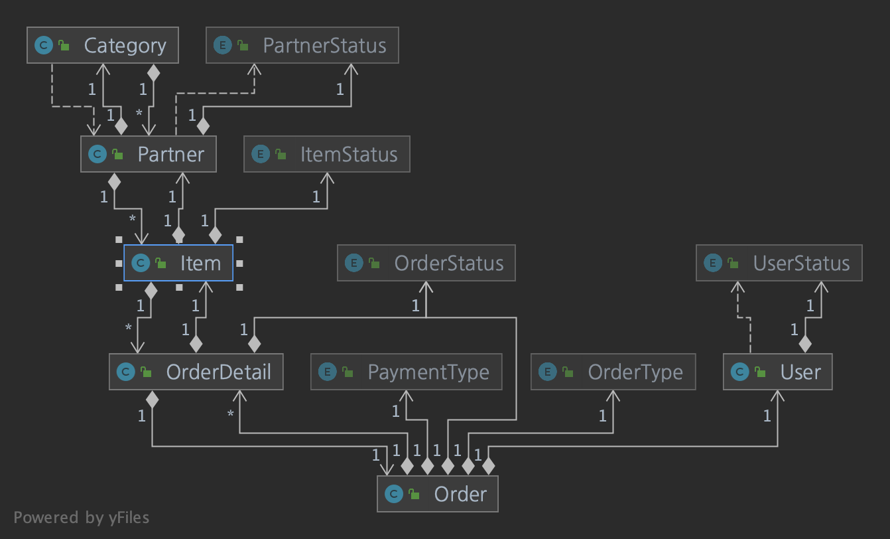
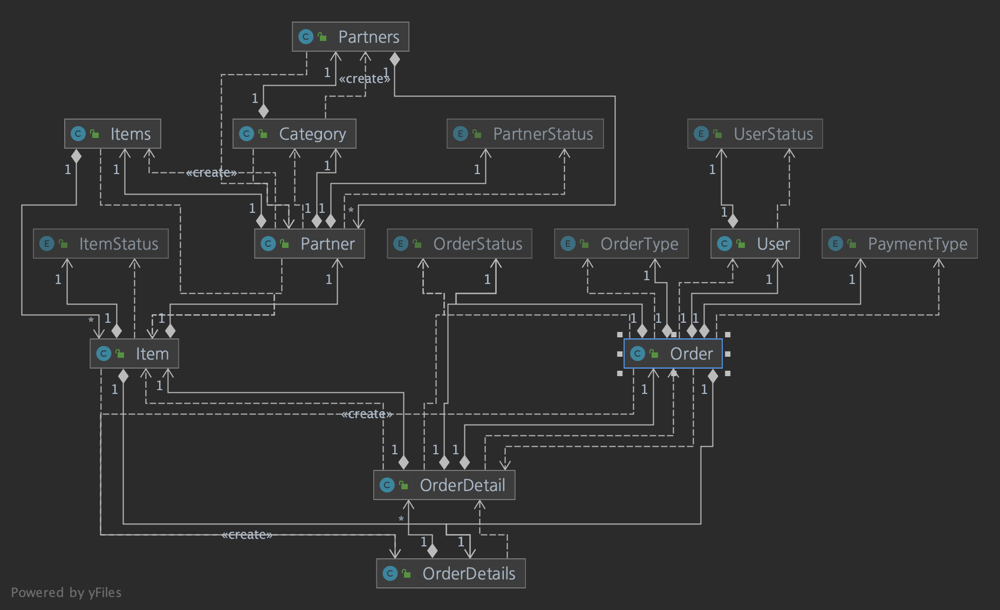

# ERP 도메인 TDD

- User(사용자 도메인)
    - 사용자 등록
    - 사용자 정보 수정
    - 사용자 상태 정보(unRegistered, registered) 변경
  
- Category(카테고리 도메인)
    - 상품의 카테고리는 파트너사를 통해 유입된다.
    - 카테고리 등록
    - 카테고리 내에 관련 파트너 등록

- Partner(파트너 도메인)
    - 파트너사를 통한 상품 유입으로 카테고리가 생성
    - 파트너 사를 통한 상품 리스트가 등록된다.

- Item(상품 도메인)
    - 파트너사를 통한 유통 상품 정보
  
- Order(주문 도메인)
    - 사용자를 통한 주문 정보

- OrderDetail(주문상세 도메인)
  - 상품 주문 상제 정보

